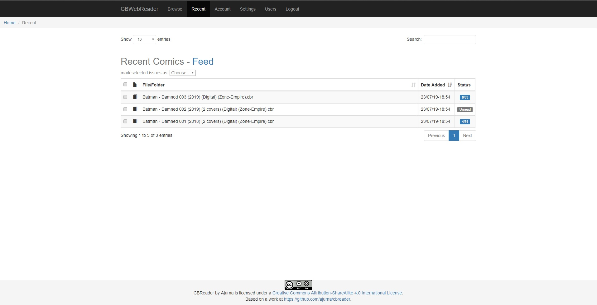

# CBWebReader 

CBWebReader is web-based CBR and CBZ file reader implemented in Django. The application allows a user to host their collection of digital comics (CBR, CBZ and PDF formats) as a remotely accessible collection.

## Core technologies

The following technologies will aid development by ensuring a consistent development environment for all developers:

- [docker](https://www.docker.com/get-started)
- [docker-compose](https://docs.docker.com/compose/gettingstarted/)

The primary frameworks and tool's are used within the application:

- [Django 3.2](https://www.djangoproject.com/)
- [python 3.7+](https://www.python.org/)

## Getting started

The CBWebReader is a Django project and follows the standard conventions for a Django application. To get started just look in the compose folder and there is an example setup.
just rename the .env.docker file to .env and add some config details and it should work right away.

## License

This is a [human-readable summary](https://creativecommons.org/licenses/by-sa/4.0/) of (and not a substitute for) the [Attribution-ShareAlike 4.0 International (CC BY-SA 4.0) License]("https://creativecommons.org/licenses/by-sa/4.0/legalcode").
